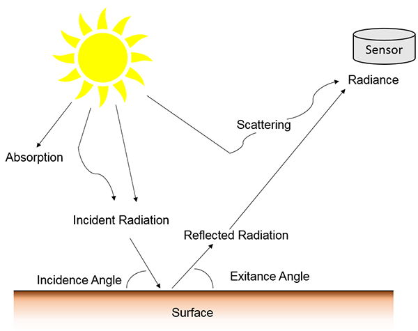
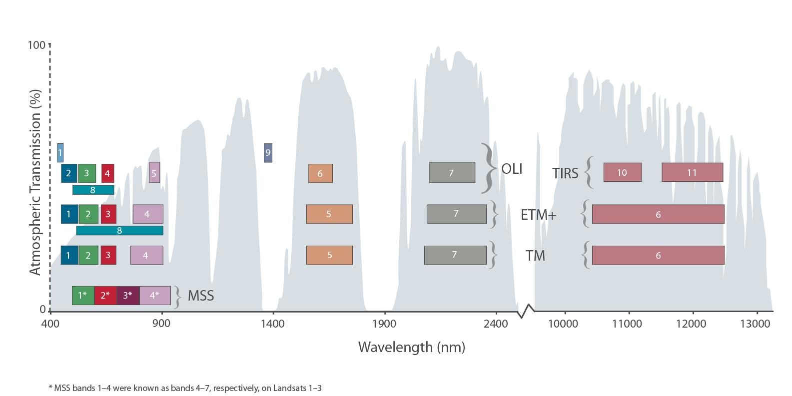
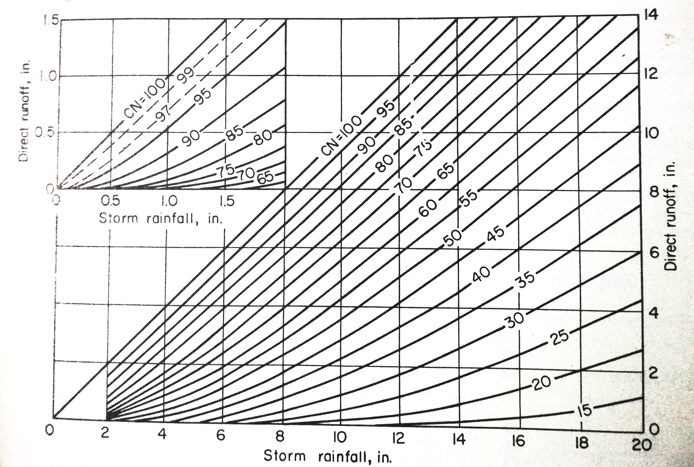
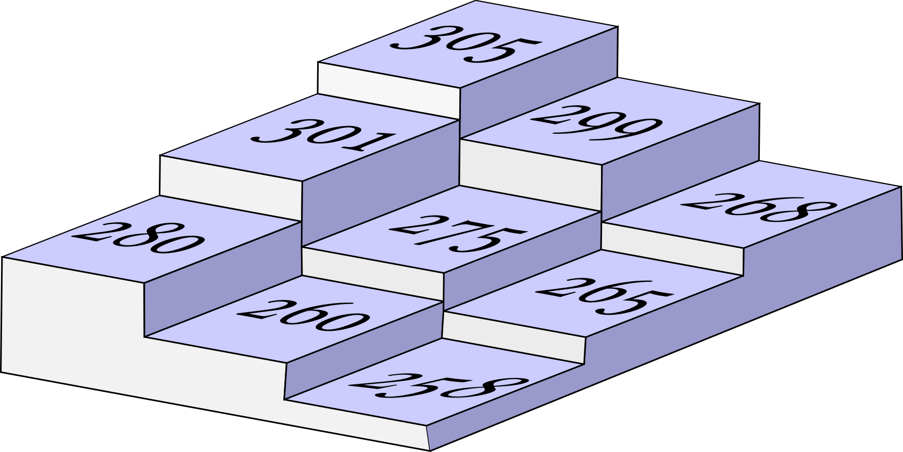
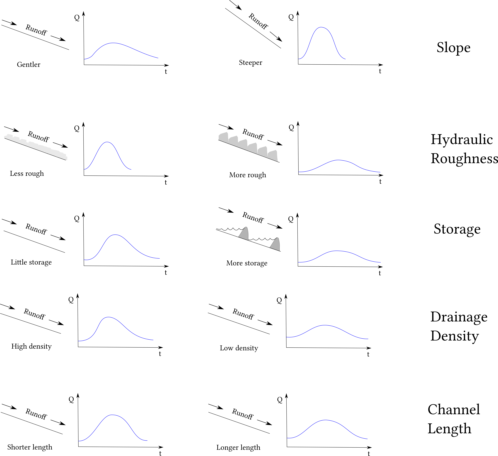
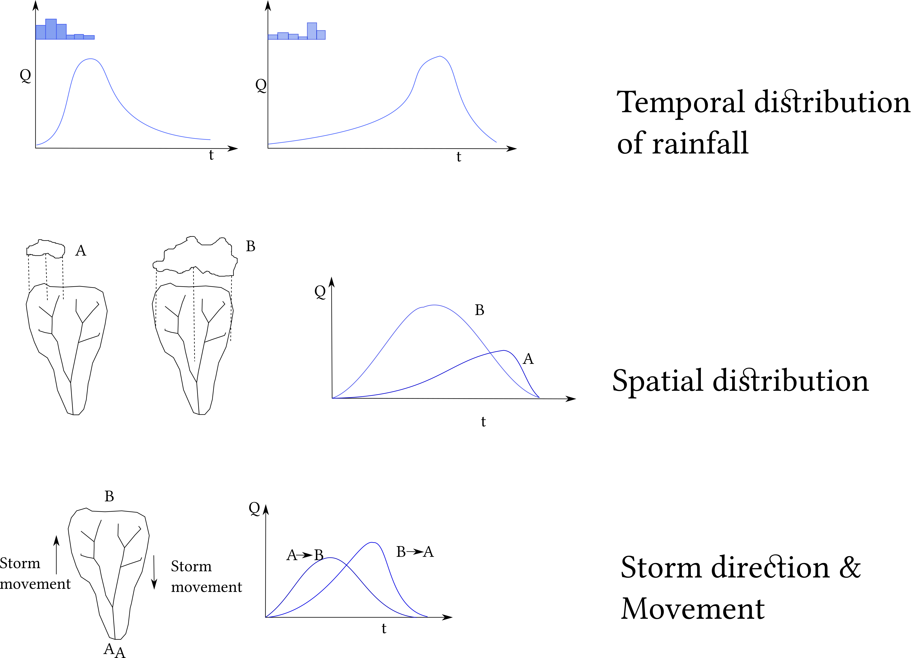

## Remote Sensing: Physical principle

 

---

## Landsat 8

 

---

## Radiometric Conversion

$$L_\lambda = M_L \times  Q_{cal} + A_L$$
$M_L$ = Radiance multiplicative scaling factor for the band 

$A_L$ = Radiance additive scaling factor for the band 

$$\rho _\lambda' = M_\rho \times Q_{cal} + A_\rho$$

$M_\rho$ = Reflectance multiplicative scaling factor for the band 

$A_\rho$ = Reflectance additive scaling factor for the band 

$$\rho _\lambda' = \frac{\rho _\lambda'}{cos\theta _{sz}} $$
$$\rho _\lambda' = \frac{\rho _\lambda'}{sin\theta _{se}} $$

$\theta_{sz}$ = zenith angle, 
$\theta_{sz}$ = elevation angle

---

## Evapotranspiration

This method proposed by Brunsell and Gillies (2003) to obtain the fraction of vegetation.

$$N = \frac{NDVI-NDVI_0}{NDVI_{max}-NDVI_0}$$

Where $NDVI_0$ = the bare soil NDVI and $NDVI_{max}$ is the maximum NDVI of full cover dense vegetation.  The fraction of cover is then estimated as

$$VegFr = N^2$$

Brunsell, N.A., and R. R. Gillies. 2003. Length Scale Analysis of Surface Energy Fluxes Derived from Remote Sensing. Journal of Hydrometeorology, 4, 1212-1219.
### Actual ET

$$AET = RefET \times VegFr$$

The reference surface is a hypothetical grass reference crop with an assumed crop height of 0.12 m, a fixed surface resistance of 70 s m-1 and an albedo of 0.23.

---
## Vegetation Condition Index -VCI

$$VCI = \frac{NDVI (x,y) - NDVI_{min} (x,y)}{NDVI_{max} (x,y)-NDVI_{min} (x,y) } \times 100$$

Kogan, F. N. F. Remote sensing of weather impacts on vegetation in non-homogeneous areas. International Journal of Remote Sensing 1990, 11, 1405–1419.

---

## GIS Data Model

---
## Runoff & Flood Hydrograph

### NRCS CN

$$\frac{P-I_a-Q}{S}=\frac{Q}{P-I_a}$$

$$Q=\frac{(P-I_a)^2}{S+P-I_a}$$
The typical value for $I_a =0.2S$
So,
$$Q =\frac{(P-0.2)^2}{(P-0.8S)}$$

--- 

## Beneth the Surface

<q>...simillar physical forms can hide radically different wiring...</q>
 Source: Nature|Vol 465|20 Nov 2008
---
## Curve Number
$$CN = \frac{1000}{S+10}$$

$$S = \frac{1000}{CN-10}$$

$$S=\frac{25400}{CN}-254$$

---

---

## DEM

---

### Watershed & Hydrograph

---

### Watershed & Hydrograph cont..

